**LAPORAN KELOMPPOK 3**  

**DATA SCIENCE**

“PENARIKAN DATA DARI SOCIAL MEDIA”  ![ref1]![ref1]

Disusun oleh :  

1. Muhamad Ripai  
1. Muhammad Defadhil Amri  
1. Muhammad Ramdhan Hakim  
1. Muhamad Bayu Fadayan 
1. Fathur Pakapradana   
1. Rafly Rahmat Amtiar  
1. Zidan Al-Rasyid  
1. Novi Khopipah 
1. Laksana Fauzta Livepud L 
1. Muhamad Yudi Aditya  
1. Amalia Kartika Putri  
1. Indah Cahyani  

(0651 21 097) (0651 21 069) (0651 21 088) (0651 21 100) (0651 21 103) (0651 21 107) 

(0651 21 112) (0651 21 113) (0651 21 115) (0651 21 116) (0651 21 118) (0651 21 120) 

Dosen Pengampu : Yusma Yanti, M.Si 

Program Studi Ilmu Komputer  

Fakultas Matematika dan Ilmu Pengetahuan Alam  Universitas Pakuan  

2022  

**KATA PENGANTAR** 

Dengan menyebut nama Allah yang maha pengasih lagi maha penyayang, puji syukur kami  panjatkan  kehadirat  Allah  swt.  Karena  dengan  rahmat dan  Karunia-nya kami  dapat menyelesaikan laporan tugas data science yang berjudul penarikan data dari social media tepat pada waktunya. 

Kami menyadari, bahwa laporan tugas data science yang kami buat ini masih jauh dari kata sempurna baik segi penyusunan, bahasa, maupun penulisannya. Oleh karena itu, kami sangat mengharapkan kritik dan saran yang membangun dari semua pembaca guna menjadi acuan agar kami bisa menjadi lebih baik lagi di masa mendatang. 

Semoga laporan tugas data science ini bisa menambah wawasan para pembaca, berguna untuk menambah pengetahuan bagi para pembaca, dan bisa bermanfaat untuk perkembangan dan peningkatan ilmu pengetahuan.  

Demikian  yang  kami  sampaikan  kami  berharap  laporan  tugas  data  science  yang berjudul penarikan data dari social media dapat bermanfaat bagi para pembaca sekalian. 

Bogor, 12 Desember 2022 

Tim Penyusun

**DAFTAR ISI** 

[KATA PENGANTAR ........................................................................................................... i ](#_page1_x69.00_y72.82)[DAFTAR ISI ........................................................................................................................ ii ](#_page2_x69.00_y72.82)[BAB 1  PENDAHULUAN.....................................................................................................1](#_page3_x69.00_y72.82)

1. [Latar Belakang .........................................................................................................1](#_page3_x69.00_y121.82)
1. [Rumusan Masalah ....................................................................................................1](#_page3_x69.00_y463.82)
1. [Tujuan .....................................................................................................................1](#_page3_x69.00_y604.82)

[BAB 2  DASAR TEORI ........................................................................................................2](#_page4_x69.00_y72.82)

1. [Definisi Ekstraksi Data ............................................................................................2](#_page4_x69.00_y121.82)
1. [Jenis-Jenis Ekstraksi Data ........................................................................................2](#_page4_x69.00_y567.82)
1. [Preprocessing Data ..................................................................................................3](#_page5_x69.00_y476.82)
1. [Data Cleaning ..........................................................................................................3](#_page5_x69.00_y616.82)
1. [Transformasi Data ...................................................................................................4](#_page6_x69.00_y286.82)
1. [Regresi.....................................................................................................................4](#_page6_x69.00_y447.82)
1. [K-Means ..................................................................................................................4](#_page6_x69.00_y628.82)

[BAB 3  PEMBAHASAN .......................................................................................................6](#_page8_x69.00_y72.82)

1. [Proses Penarikan Data..............................................................................................6](#_page8_x87.00_y121.82)
1. [Preprocessing Data ................................................................................................10](#_page12_x69.00_y72.82)
1. [Regresi dan K-Means .............................................................................................12](#_page14_x69.00_y325.82)

[BAB 4  PENUTUP ..............................................................................................................17 ](#_page19_x69.00_y72.82)[ Kesimpulan ............................................................................................................17 ](#_page19_x69.00_y121.82)[DAFTAR PUSTAKA ..........................................................................................................18](#_page20_x69.00_y72.82)

ii 
**BAB 2**  

**PENDAHULUAN** 

1. **Latar Belakang** 

Kemajuan teknologi dan perubahan terkait dalam kehidupan praktis sehari-hari telah menghasilkan perkembangan yang pesat dunia parallel konten baru, data baru, dan sumber  informasi  baru  di  sekitar  kita.  Terlepas  dari  bagaimana  seseorang mendefinisikannya, fenomena atau istilah big data semakin hadir, semakin meresap, dan semakin penting. 

Di sana adalah potensi nilai yang sangat besar dalam istilah yang kita kenal dengan big data termasuk seperti wawasan inovatif, pemahaman yang lebih baik tentang masalah, dan banyak lagi hal-hal lainnya. Itu juga dapat memberi peluang untuk memprediksi, dan bahkan untuk membentuk masa depan itu sendiri. 

Secara  umum,  data  science  adalah  sarana  utama  untuk  menemukan  dan menekankan akan potensi itu, istilah yang berarti ilmu data dalam bahasa indonesia ini menyediakan  cara  untuk  menangani  dan  memanfaatkan  kumpulan  data  besar  untuk melihat  pola,  untuk  menemukan  relasi  serta  untuk  memahami  berbagai  gambar  dan informasi yang memukau. 

2. **Rumusan Masalah** 
1. Apa itu ekstraksi data dan jenis-jenisnya? 
1. Apa yang dimaksud dengan preprocessing data? 
1. Apa yang dimaksud cleaning data? 
1. Bagaimana tahapan proses penarikan data dan mengelolanya? 
3. **Tujuan** 
1. Mengetahui definisi ekstraksi data dan jenis-jenisnya 
1. Mengetahui tentang preprocessing data 
1. Mengetahui tentang cleaning data 
1. Untuk mengetahui bagaimana tahapan proses penarikan data dan mengelolanya 

**DASAR TEORI** 

1. **Definisi Ekstraksi Data** 

   Data scraping atau yang juga sering disebut data extraction merupakan teknik atau metode otomatisasi yang memungkinkan seseorang untuk mengekstrak data dari sebuah website,  database,  aplikasi  enterprise,  atau  sistem  legacy  yang  kemudian  dapat menyimpannya ke dalam sebuah file dengan format tabular atau spreadsheet. Metode mengotomatisasi proses copy paste secara manual yang dimana proses ini memakan waktu berjam-jam atau bahkan berhari-hari. 

   Umumnya  data  scraping  digunakan  untuk  beberapa  pekerjaan  yang  berkaitan dengan data seperti research untuk konten website,keperluan bisnis dalam komparasi harga, atau  melakukan  riset  pasar  pada  sumber  data  publik.  Kebanyakan  data  pada  website merupakan data tidak terstruktur dalam format HTML yang kemudian diubah menjadi data dengan  format  terstruktur  ke  dalam  spreadsheet  atau  database  Anda  sehingga  dapat dimanipulasi. Sedangkan ada banyak cara yang digunakan dalam melakukan data scraping untuk memperoleh data dari sebuah website seperti layanan online, API tertentu atau bahkan perusahaan yang memiliki code untuk melakukan data scraping dari awal. 

   Cara terbaik yang bisa Anda coba adalah dengan memanfaatkan API (Application Programming Interface) yang dimiliki beberapa website besar seperti Google, Twitter, Facebook, sehingga memungkinkan Anda mengakses data mereka dengan format data terstruktur. Namun cara ini tidak berfungsi pada website lain yang tidak memiliki API atau yang tidak mengizinkan Anda untuk mengakses data dalam bentuk format terstruktur. 

2. **Jenis-Jenis Ekstraksi Data** 
1. Web Scraping 

   Web  scraping  memungkinkan  Anda  untuk  mengekstrak  seluruh  data  atau spesifik data yang Anda inginkan dari sebuah website dengan mengakses source code seperti  HTML,  CSS,  dan  Javascript  ataupun  menggunakan  API  yang  disediakan pemilik  website  tersebut.  Dengan  menggunakan  tools  web  scraping  Anda  dapat mengekstrak data dari website menjadi sebuah laporan yang dapat di kostumisasikan. 

2 

Web scraping membutuhkan dua bagian, yaitu crawler dan scraper dimana crawler adalah sebuah algoritma AI (Artificial Intelligence) yang melakukan pencarian data tertentu yang diperlukan dengan mengikuti link di internet. Sedangkan scraper adalah tools khusus yang dibuat untuk mengekstrak data dari website dan desain dari scraper  ini  dapat  berbeda-beda  tergantung  dari  tingkat  kompleksitas  dari pengembangnya. 

2. Screen Scraping 

   Screen  scraping  merupakan  tipe  data  scraping  yang  memperoleh  data  dari analisis visual interfaces yang dimana langsung dari tampilan website yang dapat dilihat oleh Anda. Karena tidak seperti web scraping, screen scraping tidak mengunduh dari sumber webnya melainkan melakukan scraping terhadap teks, gambar, atau konten lainnya dan membuat data tersebut ideal untuk dianalisis. 

   Umumnya  screen  scraping  digunakan  bagi  perusahaan  dan  bisnis  yang menggunakan cara ini untuk menyimpan data sensitif dan krusial yang merupakan merupakan  data  utuh  dan  disimpan  dalam  jangka  waktu  yang  lama  untuk  tujuan pencatatan. Terlebih karena screen scraping sangat cocok untuk mengekstrak data tanpa mengakses source code dan tanpa API, tipe scraping ini sangat efektif untuk migrasi data karena dapat mengakses data lama dengan akurasi yang tinggi. 

3. **Preprocessing Data** 

   Data preprocessing adalah proses yang mengubah data mentah ke dalam bentuk yang lebih mudah dipahami. Proses ini penting dilakukan karena data mentah sering kali tidak memiliki format yang teratur. Selain itu, data mining juga tidak dapat memproses data mentah,  sehingga  proses  ini  sangat  penting  dilakukan  untuk  mempermudah  proses berikutnya, yakni analisis data. 

4. **Data Cleaning** 

   Data cleaning adalah suatu prosedur untuk memastikan kebenaran, konsistensi, dan kegunaan suatu data yang ada dalam dataset. Caranya adalah dengan mendeteksi adanya error atau corrupt pada data, kemudian memperbaiki atau menghapus data jika memang diperlukan. 

3 

Alasan memakai data cleaning: 

1. Menghilangkan kesalahan dan inkonsistensi yang muncul saat beberapa data sources dikumpulkan dalam satu dataset. 
1. Meningkatkan efisiensi kerja karena proses ini akan memudahkan Anda dan tim pengolah data untuk menemukan apa yang dibutuhkan dari data. 
1. Tingkat error yang lebih rendah juga akan mendatangkan kepuasan pelanggan dan mengurangi beban kerja tim. 
1. Membantu Anda memetakan beberapa fungsi data yang berbeda. Proses ini juga akan membuat Anda lebih mengenal kegunaan data dan mempelajari asalnya. 
5. **Transformasi Data** 

   Transformasi data merupakan suatu usaha yang ditujukan untuk mengubah skala pengukuran  data  asli  menjadi  bentuk  yang  lain.  Dengan  begitu,  data  tersebut  bisa memenuhi asumsi yang mendasari analisis ragam yang berguna bagi penelitian. Namun, data yang akan ditampilkan pada laporan tersebut tetap menjadi data aslinya.Oleh karena itu, data transformasi tersebut dapat membantu peneliti untuk membuat data asli untuk memenuhi analisis ragam. 

6. **Regresi** 

   Pada dasarnya, metode regresi merupakan salah satu metode analisis statistik yang bertujuan untuk menentukan hubungan sebab akibat antar variabel. Dalam pengertian lain, regresi adalah metode statistik yang digunakan untuk memperkirakan hubungan antara sebuah variabel dependen/terikat dan satu atau lebih variabel independen/bebas untuk melihat seberapa besar pengaruh variabel independen pada variabel dependen. Regresi merupakan rumus  yang  bisa  digunakan  untuk  menganalisis  data  dari  yang  sederhana, sampai yang jumlahnya begitu banyak atau kompleks. 

7. **K-Means** 

   K-means merupakan salah satu algoritma yang bersifat unsupervised learning. K- Means memiliki fungsi untuk mengelompokkan data kedalam data cluster. Algoritma ini dapat  menerima  data  tanpa  ada  label  kategori.  K-Means  Clustering  Algoritma  juga merupakan metode non-hierarchy. Metode Clustering Algoritma adalah mengelompokkan beberapa data ke dalam kelompok yang menjelaskan data dalam satu kelompok memiliki karakteristik yang sama dan memiliki karakteristik yang berbeda dengan data yang ada di kelompok lain. Cluster Sampling adalah teknik pengambilan sampel di mana unit-unit populasi dipilih secara acak dari kelompok yang sudah ada yang disebut ‘cluster, nah Clustering  atau  klasterisasi  adalah  salah  satu  masalah  yang  menggunakan  teknik unsupervised learning. 

**BAB 3  
PEMBAHASAN** 

1. **Proses Penarikan Data** 

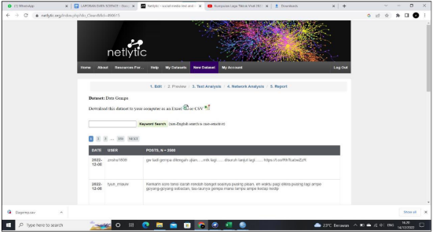

Disini kita Menarik 2500 buah sample data dari  sebuah platform media social yaitu Twitter menggunakan web *Netlytic.org***,** yang dimana kita mengambil data berupa cuitan atau tweet yang membahas tentang gempa yang belakangan ramai di bicarakan banyak orang.  

Yang dimana data yang nanti kita dapatkan sebagai berikut : 

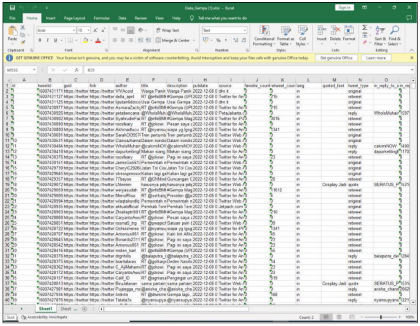

Yang dimana data awalnya berjumlah sekitar 2500 responden dan variabel atau atributnya berjumlah 29 buah. 

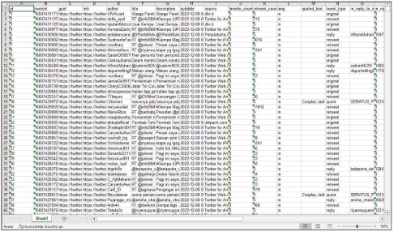

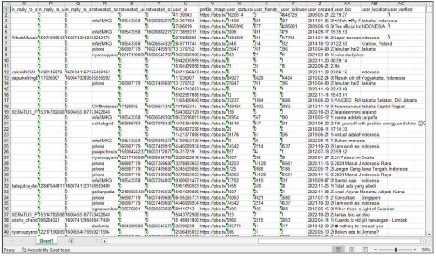

Kemudian kita ambil beberapa atribut yang sekiranya bisa kita ambil atau olah yaitu Tweet id, User id, User Friends, User follower, User Statuses count dan Tweet Type. dan juga beberapa responden yaitu sekitar 499 orang/akun.  

` `Kemudian  kita  jadikan  file  yang  tadinya  berbentuk  format .xlsx  menjadi  .csv dengan cara mennyimpan file excel tersebut menjadi file CSV melalui aplikasi excel. yang dimana hasilnya  sebagai berikut: 

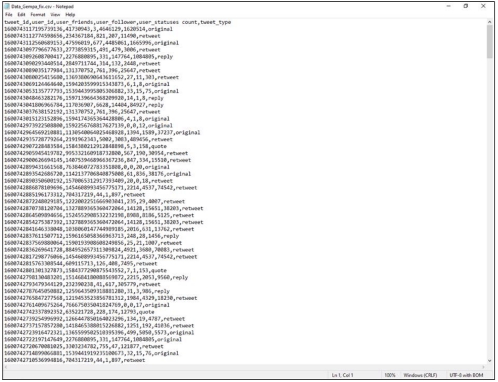

Kemudian baru data bisa kita masukkan kepada aplikasi WEKA,dan baru kita masuk kepada tahap pre-processing. 

Di dalam aplikasi WEKA kita mendapatkan beberapa atribut tersebut bertipe data yakni : Tweet id, User id, User Friends, User follower, User Statuses count bertipe data numeric dan Tweet type bertipe data nominal. 

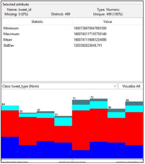 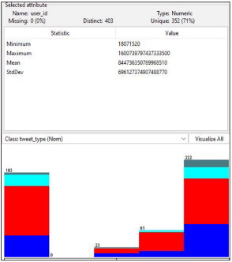

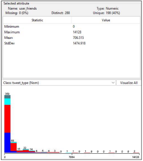 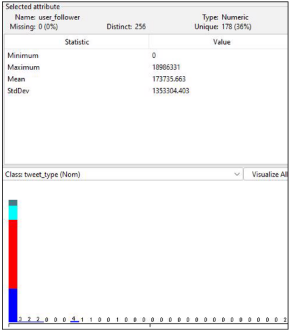

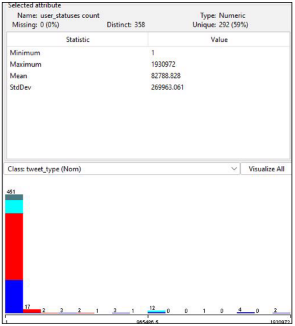 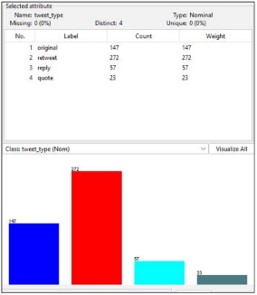

2. **Preprocessing Data** 

   Disini  yang  kita  lakukan  pertama  kali  dalam  Pre-  Processing  Data  yaitu  kita membersihkan data tersebut dari missing data dan data yang mengandung duplikat (Data Cleaning). Sebagai berikut:  

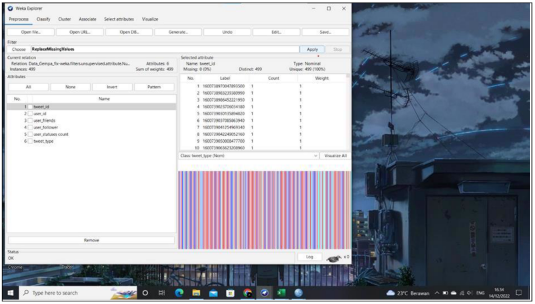

Yang  dimana  kita  menggunakan  metode  ReplaceMissingValues,  yang  menjadi semua atribut data yang berparameter Missing menjadi 0 atau 0% yang menandakan bahwa data tidak mempunyai Missing Value. 

Kemudian  kita  menggunakan  metode  Remove  Duplicate  yang  sekiranya  kita memiliki data yang sama atau duplikat data akan dihapus 

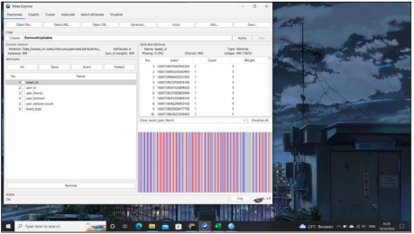

Yang dimana pada tahap ini hasilnya sebagai berikut: 

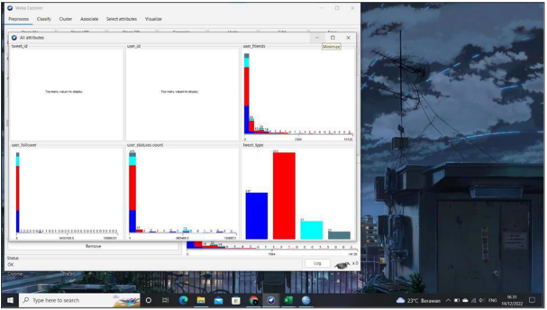

Kemudian setelah itu kita masuk kepada tahap tranformasi data, yang dimana pada tahap ini kita menggunakan metode normalisasi dan diskritisasi. Sebagai berikut: 

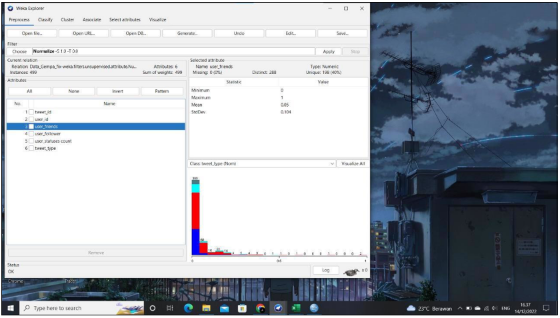

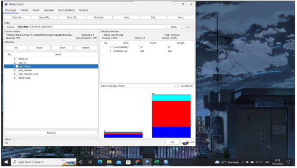

3. **Regresi dan K-Means** 

   Selanjutnya adalah regresi yang dimana kita disini menggunakan aplikasi SPSS yang dimana kita mengambil metode regresi linier berganda. Untuk mengetahui apakah jumlah pertemanan dan jumlah status mempengaruhi jumlah follower. Dimana datanya sebagai berikut: 

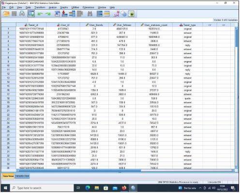

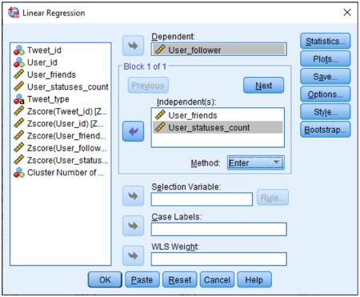

Kemudian kita jadikan atribut User follower sebagai variabel dependen (variabel Y) yaitu variabel yang dipengaruhi, sedangkan untuk atribut User friends dan User statuses count kita jadikan sebagai variabel independen (variabel X) yaitu variabel yang mempengaruhi. 

Yang dimana hasil regresi nya sebagai berikut: 

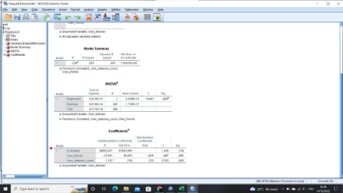

Kita bisa lihat nilai signifikansi dari tabel anova adalah 0,  itu nilainya kurang dari 0,05, yang berarti jumlah pertemanan dan jumlah status mempengaruhi jumlah follower 

Kemudian kita bisa lihat pada tabel coefficient. Pada jumlah pertemanan kita bisa melihat nilai signifikansi nya yaitu 0,486 yang dimana nilainya itu lebih dari 0,05, yang artinya jumlah pertemanan tidak memengaruhi jumlah follower. Tapi pada jumlah status ,Kita  bisa  lihat  nilai  signifikansi  nya  adalah  0  yang  dimana  kurang  dari  0,05,  yang mengartikan bahwa  Jumlah status mempengaruhi jumlah follower. 

Kemudian kita masuk Ke tahap clustering K- mean Yang dimana kita menggunakan 2 metode yaitu dengan aplikasi SPSS dan WEKA. Pada aplikasi SPS Kita terlebih dahulu menormalisasi kan data yang ada. Yang tujuannya adalah menyamakan semua satuan atribut menjadi Zscore 

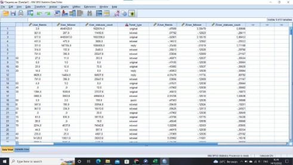

Kemudian kita bisa mengolah datanya menggunakan data Zscore tersebut untuk proses clustering K-mean.  

Pada proses clustering kita membagikan data data tersebut menjadi 4 kelompok yang dikelompokkan berdasarkan Tweet type. 

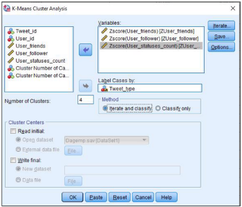

Yang didapatkan hasilnya sebagai berikut : 

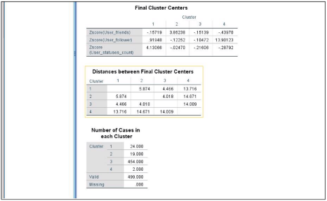

Bisa kita lihat di dalam kluster pertama terdapat jumlah data sebanyak 24 buah, sedangkan di dalam kluster kedua terdapat 19 buah data, di kluster keempat terdapat 454 buah data dan klister keempat terdapat 2 buah data. Yang dimana terdapat jarak diantara beberapa klaster data sebagaimana yang tercantum di dalam tabel “Distances between Final Cluster Centers”, dan juga terdapat nilai tengah data pada masing masing klaster sebagaimana yang tercantum pada table “Final Cluster Centers” 

Kemudian kita menggunakan metode Aplikasi WEKA yang dimana kurang lebih dengan metode yang sama seperti SPSS membagi 4 kelompok berdasarkan label tweet type.  yang dimana kita mendapatkan hasilnya sebgai berikut : 

|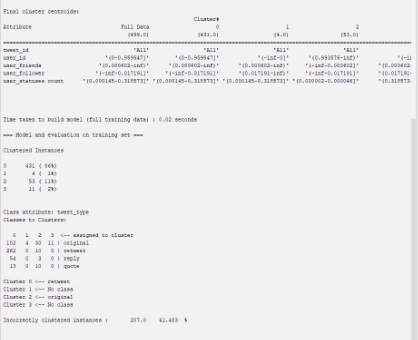||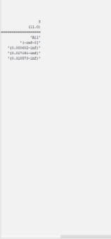|
| - | :- | - |

Sebagaimana yang tercantum pada gambar, kita membagi 4 klaster data dan setiap klaster mempunyai rentang nilai yang unik tersendiri, yang dimana klaster 0 terdapat 100 buah tweet bertipe original, 262 buah tweet bertipe retweet, 54 buah tweet bertipe reply dan 13 buah tweet bertipe quote 

Untuk klaster 1 di dalamnya hanya terdapat 4 buah tweet original, untuk klaster  2 di dalamnya terdapat 30 buah tweet bertipe original, 10 tweet bertipe retweet, 3 tweet bertipe reply , dan 10 tweet bertipe quote. 

Sedangkan untuk klaster terakhir yaitu klaster 3 di dalamnya hanya mengandung 11 tweet bertipe original  

**BAB 4  PENUTUP** 

 **Kesimpulan** 

Dalam pengumpulan data digunakan web *Netlytic.org***,** yang dimana  mengambil data berupa cuitan atau tweet yang membahas tentang gempa. Selanjutya dalam tahap preprocessing data menggunakan aplikasi WEKA dalam peroperasiannya. Dalam tahap regresi data menggunakan aplikasi SPSS mengambil metode regresi linier berganda. Untuk mengetahui apakah jumlah pertemanan dan jumlah status mempengaruhi jumlah follower. Dimana hasil dari tabel anova adalah 0,  dimana nilainya kurang dari 0,05, yang berarti jumlah pertemanan dan jumlah status mempengaruhi jumlah follower. Tahap selanjutnya menggunakan aplikasi SPSS dan WEKA untuk mengelola K-Means yang dimana hasilnya terbagi dalam 3 kluster. 

**DAFTAR PUSTAKA** 

Bryan Orleans, E. P. (2022, Januari 31). *Clustering Algoritma (K-Means)*. Diambil kembali 

dari Binus University: https://sis.binus.ac.id/ 

By Sekolah Stata. (t.thn.). *Regresi adalah Metode Analisis Statistik, Manfaat, dan Rumus*. 

Diambil kembali dari By Sekolah Stata: https://sekolahstata.com/ 

*Data Scraping : Definisi, Cara Kerja dan 2 Tipe/Jenisnya*. (2022 , Januari 13). Diambil 

kembali dari IDCloudHost: https://idcloudhost.com/ 

Haryanto, A. (2021, Februari 17). *Data Cleansing: Pengertian, Manfaat, Tahapan dan Caranya*. Diambil kembali dari Jojonomic: https://www.jojonomic.com/ 

Konsultan Data Penelitian & ArcGIS. (2020, Agustus 19). *Ragam Jenis Transformasi Data* 

*yang Wajib Diketahui*. Diambil kembali dari patrastatistika: https://patrastatistika.com/ 

Muchamad Taufiq Anwar, L. H. (2021). Model Prediksi Dropout Mahasiswa. *JURNAL* 

*INFORMATIKA UPGRIS*. 

*Pentingnya Data Cleaning Dalam Data Science*. (2022, Februari 10). Diambil kembali dari 

algoritman: https://algorit.ma/ 
18 

[ref1]: images/Aspose.Words.24971826-0038-4368-baa3-acb34a2d6434.001.png
